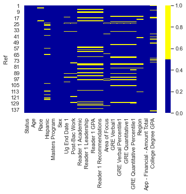
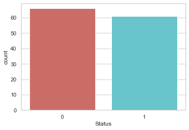
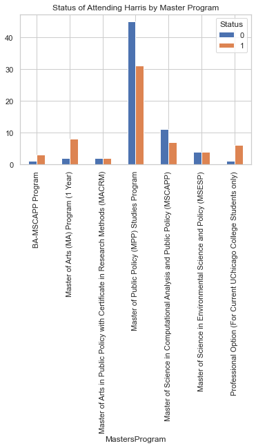
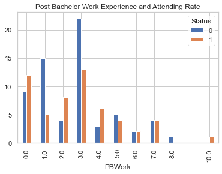
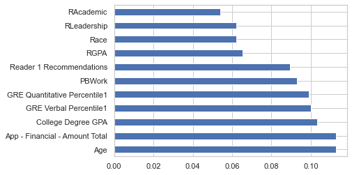
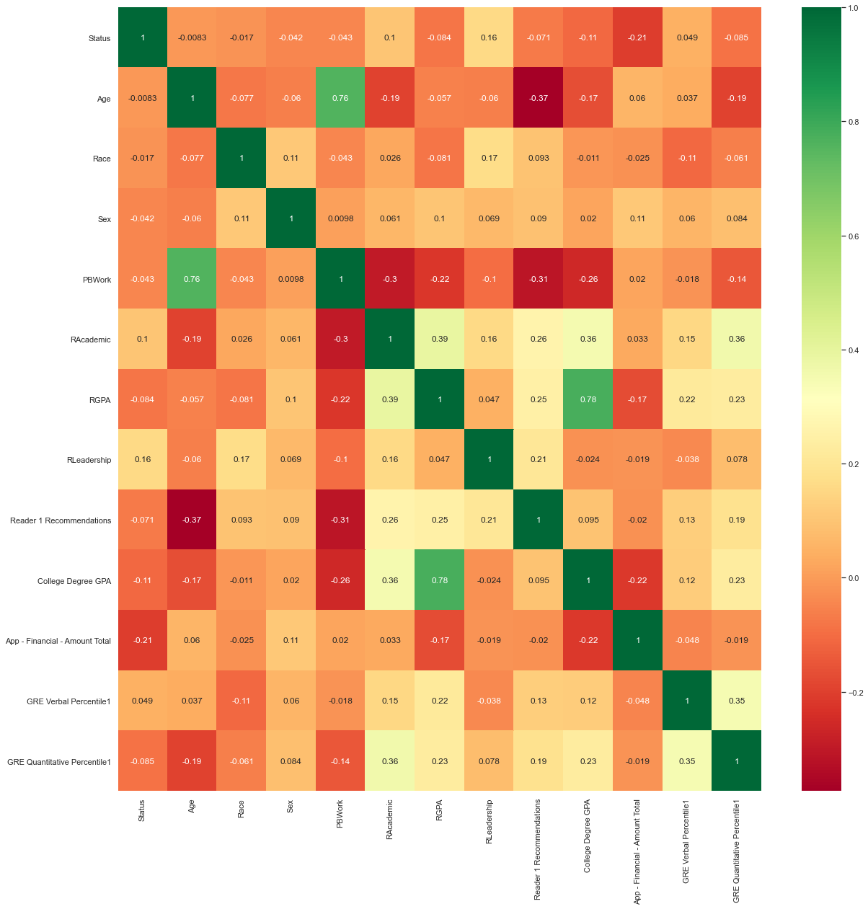
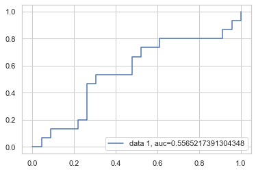
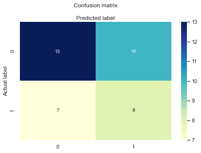

# Short Report - Attending or Not Attending

Chuqing Zhao (Master of Computational Social Science - First Year)

cqzhao@uchicago.edu

**Data:  data set with demographic information of students with 141 observations**

**To read full Python script**:https://github.com/LouisaZhao1998/Harris-Data-Task/blob/main/Harris%20Data%20Task.ipynb 


**Task**: 1. Perform predictive modeling (the choice of models to use is up to you; please include logistic regression and any other models you’d like) with the dependent variable being “Status” (Status = 1 means attending and status = 0 means not attending) and the independent variables being the rest of the variables available in this data set. 2. Clean data and consider missing data. 3. Interesting observations or patterns that you see from the data.

**Procedure**: 

|   Task    | Time to Complete |
| ----------- | ----------- |
| Data Browsing| 30 - 40 mins      |
| Data Cleaning   |  40-60 mins |
| Missing Data| 40 - 60 mins      |
| Exploratory Data Analysis   | Approximate 60 mins        |
| Feature Selection   | Approximate 40mins        |
| Prediction and Model Selection   | Approximate 2 hours       |

**1. Data Browsing**

To understand the data structure in the datasets, I have converted the data into pandas dataframe, browse the type of each columns and examined the missing data.

I find the variables with most missing values are: "Reader 1 Academic", "Reader 1 GPA", "Reader Leadership" and "Reader 1 Recommendations". "Race", "Sex", "Reader" columns are categorical data required to convert into numerical ones. "Sex", "Ug End Date 1" and "Post-Bac Work" consists of textual information, which needs to extract the digit from the textual data into int/float.


```python
Image.open("C:/Users/Louisa Zhao/Desktop/21 Spring Quarter/Harris Data/7.png")
```


    

    


**2. Data Cleaning and Missing Data**

The basic procedure of data cleaning includes the following steps: 1. I drop outliers, such as GPA is larger than 5. Then, for categorical data, I convert the textual data into numerical ones. For example, for "Race" I use 0-5 to represent different races (0:others, 1:White,2:Black,3:Asian,4:American Indian native 5: other natives). 

2. I manually split and extract digital data from mixed-type of data, such as "3 years" I will keep "3" instead of "3 years". 

3. I drop NaT and NaN data in the dataframe for each columns. 

The total observation after cleaning data is 93. I do not choose to impute data because imputing might negatively influence the prediction and cross-validation could deal with the small-size sample issue.

**3.Exploratory Data Analysis** 

The total number of choosing to attend to Harris and not to attend is quite balanced. The number of attending is 61 and the number of not attending is 66. Therefore, in the prediction, I do not need to consider the imbalance distribution of dummy variables. 


```python
Image.open("C:/Users/Louisa Zhao/Desktop/21 Spring Quarter/Harris Data/8.png")
```


    

    


*Compare to the demographic difference between attending and not attending:*

1. Age: the average age of those who choose to attend Harris and those who do not are similiar;
2. Reader Academic and Leadership is higher for those who choose to attend Harris, while Reader Recommendations are lower for those who choose to attend;
3. GRE and GPA: GRE and GPA are similiar in two groups.

*Considering the Master Program and Attending Rates:*

MPP and MSCAPP program has the lowest attending rates while Professional option, BA-MSCAPP and MA (1 Year) enjoy the highest attending rates. The possible explaination could be the MPP/MSCAPP have many alternative programs at the UChicago or other universities, while the Professional option and BA-MSCAP could be quite unique compared to other universites. Another explaination could be the admission rate of MSCAPP and MPP could be higher than other program, which means the people who apply for those two programs could also apply for similar programs. 


```python
Image.open("C:/Users/Louisa Zhao/Desktop/21 Spring Quarter/Harris Data/3.png")
```


    

    


*Considering the area of focus and Attending Rates:*

International Policy, Child and Family Policy and Methods of Policy Analysis are three most attrative programs with highest attending rates. This could be owned to the advantages of Harris and UChicago's methodology training courses in policy analysis and international relation education.

*Considering the Working Experience and Attending Rates:*

People who have one year and three year post bachelor working experience are more likely to choose not to attend Harris. On the contrary, fresh graduates are more likely to attend Harris.


```python
Image.open("C:/Users/Louisa Zhao/Desktop/21 Spring Quarter/Harris Data/4.png")
```


    

    


**4. Feature Selection**

Conclusion of feature selection: according to the importance score and correlation, I tend to keep 9 variables('Status','Age','Race','Sex','RAcademic','RLeadership',
                  'Reader 1 Recommendations','App - Financial - Amount Total',
                  'GRE Verbal Percentile1','GRE Quantitative Percentile1'):
1. I tend to keep 'Age' as a variable and drop 'PBWork (Post Bachelor Work)' since age has higher importance score and highly correlated with PBWork, which might cause overfitting.

2. I tend to keep 'College Degree GPA' and drop 'RGPA' for the same reason. 


```python
import webbrowser
Image.open("C:/Users/Louisa Zhao/Desktop/21 Spring Quarter/Harris Data/1.png")
```


    

    


```python
Image.open("C:/Users/Louisa Zhao/Desktop/21 Spring Quarter/Harris Data/2.png")
```


    

    


**5. Prediction: Logistic Regression Logistic Regression with Cross Validation and KNN**

First, I completed a traditional logistic regression, but since the sample size is relatively small. I tend to use cross validation, which could make the best use of small-size data by splitting into different folds and avoid the overfitting problem. After the logistic regression, I find the accuracy only reaches to 50%. 

Second, I choose KNN as a classification method to predict due to the unsatistifactory accuracy rates of logistic regression. Also, classification could be better at predicting discrete class label. 

However, as a result, I think logistic regression and KNN has similar performance:

|   Algorithm    | Accuracy Score |
| ----------- | ----------- |
| KNN: cv_scores mean| 0.4545454545454545      |
| Logistic Regression:cv_scores mean|  0.5333333333333333 |


```python
Image.open("C:/Users/Louisa Zhao/Desktop/21 Spring Quarter/Harris Data/5.png")
```


    

    


```python
Image.open("C:/Users/Louisa Zhao/Desktop/21 Spring Quarter/Harris Data/6.png")
```


    

    


